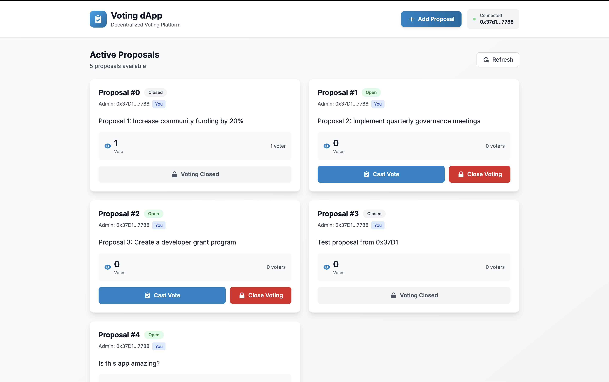

# 🗳️ Decentralized Voting dApp



### **Summary**

A decentralized web application where users can connect their Ethereum wallets and vote on on-chain proposals.

Votes are stored immutably on the blockchain, ensuring transparency and fairness.

This project demonstrates end-to-end Web3 development — from smart contract design to frontend wallet integration — deployed on the **Sepolia test network**.

---

## 🎯 Purpose

- Learn the fundamentals of **blockchain development** and **smart contracts**.
- Build a fully functional decentralized application (dApp).
- Showcase skills in **Solidity**, **React**, and **ethers.js** on your resume or GitHub portfolio.
- Understand how wallet authentication and blockchain transactions work.

---

## 🧱 Core Features

- Create and store proposals on-chain.
- Allow one wallet to cast exactly one vote per session.
- Prevent double-voting using address mapping.
- Enable an **admin** to close voting.
- Display live proposal data and results via the frontend.
- Fully decentralized: no centralized backend or database.

---

## 🧩 Architecture Overview

| Layer | Technology | Purpose |
| --- | --- | --- |
| **Smart Contract** | Solidity | Manages proposals, votes, and access control. |
| **Blockchain Network** | Ethereum Sepolia Testnet | Public decentralized ledger to store data. |
| **Frontend** | React + ethers.js | User interface with wallet connection. |
| **Tooling** | Hardhat | Compile, test, and deploy contracts. |
| **Wallet Integration** | MetaMask | Enables users to connect and sign transactions. |
| **RPC Provider** | Alchemy or Infura | Provides blockchain access for deployment. |

---

## 🔐 Smart Contract Specification

**Contract Name:** `Voting.sol`

### State Variables

- `Proposal[] public proposals` – List of proposals.
- `mapping(address => bool) public hasVoted` – Tracks who has voted.
- `address public admin` – Contract owner.
- `bool public votingOpen` – Indicates if voting is still open.

### Functions

| Function | Visibility | Description |
| --- | --- | --- |
| `constructor(string[] memory descriptions)` | public | Initializes proposals and sets deployer as admin. |
| `vote(uint256 proposalId)` | external | Records a vote for a proposal (1 per wallet). |
| `closeVoting()` | external (only admin) | Closes voting permanently. |
| `proposalCount()` | view | Returns total proposals count. |

### Events

- `VoteCast(address indexed voter, uint256 indexed proposalId)`
- `VotingOpened()`
- `VotingClosed()`

---

## 💻 Frontend Specification

**Framework:** Next.js 14 + TypeScript + Tailwind CSS

### Key Components

- **Wallet Connection:** MetaMask integration to authenticate users.
- **Proposals List:** Beautiful card-based layout displaying descriptions, vote counts, and status.
- **Voting Buttons:** Trigger on-chain vote transactions with real-time feedback.
- **Status Display:** Shows connection status, network, and voting state with modern UI.
- **Admin Controls:** Add proposals and close voting with transaction confirmations.

### UI Flow

1. User opens the app.
2. Clicks **"Connect Wallet"** → MetaMask prompt.
3. Proposals load from blockchain.
4. User clicks **"Vote"** → Transaction confirmation in MetaMask.
5. After mining, results update instantly.
6. Admin can close voting to lock further submissions.

### Features Implemented

✅ **Beautiful Modern UI** - Gradient designs, smooth animations, responsive layout
✅ **Real-time Transaction Status** - Inline feedback for all blockchain operations
✅ **Smart Contract Integration** - Full ethers.js v6 integration with TypeScript
✅ **Admin Dashboard** - Create proposals and manage voting status
✅ **Vote Tracking** - Prevents double-voting with real-time status checks
✅ **Network Detection** - Automatic network identification and display
✅ **Error Handling** - User-friendly error messages and recovery

## 🚀 Quick Start

### Smart Contract (Already Deployed)

Your contract is deployed on Sepolia at:
```
Check: ignition/deployments/chain-11155111/deployed_addresses.json
```

### Frontend Setup

```bash
cd frontend
npm install
npm run dev
```

Open http://localhost:3000 and connect your MetaMask wallet!

For detailed setup instructions, see [FRONTEND_SETUP.md](FRONTEND_SETUP.md)

---

## ⚙️ Tooling & Configuration

| Component | Tool |
| --- | --- |
| Blockchain Dev | Hardhat |
| Testing | Mocha + Chai |
| Node Provider | Alchemy / Infura |
| Environment Variables | `.env` |
| Wallet | MetaMask |
| Hosting | Vercel or Netlify (free) |

### Environment Variables

```
SEPOLIA_RPC_URL=https://eth-sepolia.g.alchemy.com/v2/YOUR_KEY
PRIVATE_KEY=YOUR_PRIVATE_KEY

```

---

## 🧠 Learning Outcomes

By completing this project, you’ll understand:

- How to write and deploy **Solidity** smart contracts.
- How wallets sign and broadcast blockchain transactions.
- How to connect **React frontends** to blockchain networks.
- How to manage network configuration, gas fees, and ABI interactions.

---

## 🧾 Phased Build Plan

### **Phase 0: Setup & Fundamentals**

- Install Node.js, Hardhat, and MetaMask.
- Create Alchemy/Infura account for RPC endpoint.
- Get Sepolia test ETH from a faucet.

---

### **Phase 1: Smart Contract Development**

- Write `Voting.sol` with:
    - Proposal array
    - Single-vote-per-address logic
    - Close voting control
- Test locally using Hardhat’s network.
- Confirm voting logic and event emission.

---

### **Phase 2: Testnet Deployment**

- Add Sepolia network config to `hardhat.config.js`.
- Use `.env` variables for private key and RPC.
- Deploy contract and record the deployed address.

---

### **Phase 3: Frontend Integration**

- Build React frontend with ethers.js.
- Load contract ABI and address.
- Implement Connect Wallet, Vote, and Close buttons.
- Display proposal data and transaction status.

---

### **Phase 4: Hosting & Demo**

- Deploy frontend to Vercel or Netlify (free).
- Add contract address + Etherscan link in README.
- Optional: Add simple design polish (TailwindCSS).

---

### **Phase 5: Extensions (Optional)**

- **Token-weighted voting:** Count votes based on ERC-20 balances.
- **Off-chain proposals:** Store proposal metadata on IPFS.
- **Analytics:** Display real-time charts for vote counts.

---

## ✅ Success Criteria

- Contract compiles, deploys, and functions correctly on Sepolia.
- Wallet connects via MetaMask.
- User can vote once per wallet.
- Voting state changes when admin closes the poll.
- Frontend is deployed publicly and fully functional.

---

## 🧩 Deliverables

| Deliverable | Description |
| --- | --- |
| `Voting.sol` | Smart contract code |
| `deploy.js` | Deployment script |
| `App.jsx` | Frontend app |
| `.env.example` | Example config |
| `README.md` | Instructions + Sepolia link |

---

## 🧾 Example Summary for Portfolio

> Decentralized Voting dApp (Web3 Project)
> 
> 
> Built a blockchain-based voting application using Solidity, Hardhat, and React.
> 
> Integrated wallet authentication with MetaMask and deployed on the Sepolia testnet.
> 
> Demonstrates smart contract deployment, event handling, and blockchain-frontend interaction.
> 

---